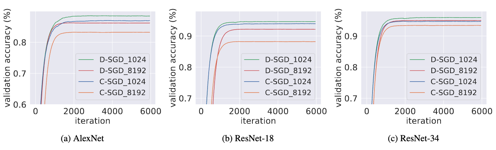

# The repository contains the codes of D-SGD and C-SGD

The results of AlexNet, ResNet-18 and ResNet-34 using D-SGD and C-SGD on CIFAR-10 are shown in the following figure.


## Example of usage

#### Perform the ResNet-18 on CIFAR-10 using D-SGD and C-SGD for the total batch size of 1024.

```
python main.py --dataset_name "CIFAR10" --image_size 56 --batch_size 64 --mode "csgd" --size 16 --lr 0.1 --model "ResNet18_M" --warmup_step 60 --milestones 2400 4800 --early_stop 6000 --epoch 6000 --seed 666 --pretrained 1 --device 0

python main.py --dataset_name "CIFAR10" --image_size 56 --batch_size 64 --mode "ring" --size 16 --lr 0.1 --model "ResNet18_M" --warmup_step 60 --milestones 2400 4800 --early_stop 6000 --epoch 6000 --seed 666 --pretrained 1 --device 0
```

#### Perform the ResNet-18 on CIFAR-10 using D-SGD and C-SGD for the total batch size of 8192.

```
python main.py --dataset_name "CIFAR10" --image_size 56 --batch_size 512 --mode "csgd" --size 16 --lr 0.8 --model "ResNet18_M" --warmup_step 60 --milestones 2400 4800 --early_stop 6000 --epoch 6000 --seed 666 --pretrained 1 --device 0

python main.py --dataset_name "CIFAR10" --image_size 56 --batch_size 512 --mode "ring" --size 16 --lr 0.8 --model "ResNet18_M" --warmup_step 60 --milestones 2400 4800 --early_stop 6000 --epoch 6000 --seed 666 --pretrained 1 --device 0
```

More detailed scripts can be found in the folder 'scripts'.